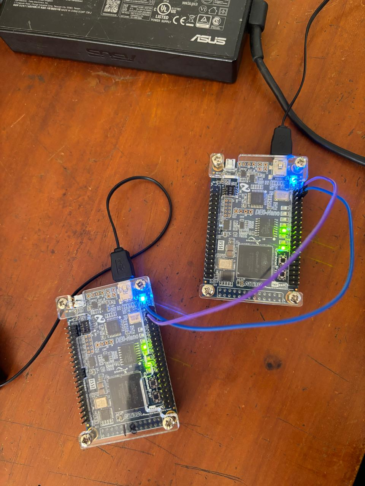

# UART Implementation on FPGA

This repository contains the implementation of a Universal Asynchronous Receiver/Transmitter (UART) module on a Field-Programmable Gate Array (FPGA). This project was completed as part of the **EN2111 - Electronic Circuit Design** module at the **Department of Electronic & Telecommunication Engineering, University of Moratuwa, Sri Lanka**.

---

## 🎯 Objective

The objective of this project is to design, implement, and verify a UART module on an FPGA, enabling reliable asynchronous serial communication.

---

## 🔑 Key Features

- 📡 Full UART protocol implementation
- 💻 FPGA-based design and simulation
- 🔬 Comprehensive testbench development
- 🛠️ RTL code for both transmitter and receiver
- 📊 ModelSim simulation and timing analysis

---

## 📁 Project Overview

The project was completed in four main phases:

### Phase 1: Research and Design Selection
- Studied UART protocol: data framing, synchronization, baud rate settings
- Explored existing Verilog UART implementations
- Selected a design suited to project requirements

### Phase 2: Testbench Development
- Developed Verilog testbenches for UART modules
- Simulated various data patterns and baud rates
- Debugged using ModelSim

### Phase 3: FPGA Implementation
- Set up FPGA environment using Intel Quartus
- Integrated 7-segment display drive logic
- Verified functionality and synthesized design
- Mapped GPIO pins and generated bitstream

### Phase 4: Signal Analysis
- Used oscilloscope to probe UART TX and RX lines
- Verified start bit, data bits, parity, stop bits
- Analyzed waveform timing and signal integrity

---

## 🛠️ Hardware & Software Requirements

### Hardware
- FPGA development board (e.g., DE0 Nano)
- Oscilloscope (for hardware signal analysis)

### Software
- Intel Quartus (for RTL design & FPGA programming)
- ModelSim (for simulation and verification)

## 📁 Project Output

